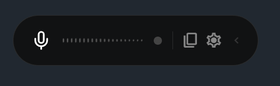
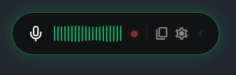
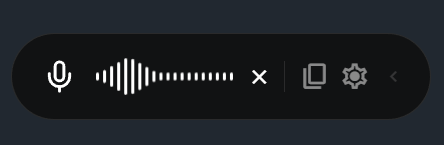
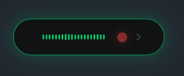
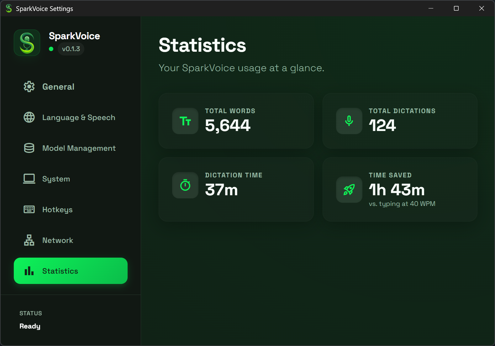

# ✨ SparkVoice

**The essential vibe coding companion — dictate your thoughts, ship your code faster.**  
SparkVoice is a high-performance, privacy-focused desktop dictation tool that every developer needs in their toolkit. Powered by OpenAI's Whisper models running entirely on your machine, it lets you dictate into *any* application with multi-language auto-detection and full GPU acceleration. No cloud, no latency, no excuses.

### Pill UI

| Idle | Listening | Working | Compact |
|------|-----------|---------|---------|
|  |  |  |  |

### Settings




---

## 🚀 Key Features

- **🏎️ Hardware Accelerated**: Leverages NVIDIA CUDA (Windows) or Apple Metal (macOS) for near-instant transcription on modern GPUs.
- **✨ Intelligent Auto-Detect**: Automatically switches between your preferred languages while ignoring others.
- **📦 Model Management**: Download, select, and delete models (Tiny to Large-v3) directly within the app.
- **🌊 Responsive Waveform**: Real-time audio visualization with high-energy peak detection.
- **⌨️ Universal Injection**: Press `F2` to dictate anywhere—Word, Chrome, Slack, or your favorite IDE.
- **🛡️ 100% Private**: Everything runs locally on your machine. No cloud, no subscriptions, no tracking.
- **📊 Usage Statistics**: Track total words dictated, transcription count, dictation time, and time saved vs. typing.
- **🌐 Network Trigger API**: Control recording remotely via a local REST API (`POST /start`, `/stop`, `/toggle`) with optional Bearer token authentication and optional transcription text return.
- **📝 Transcription Logging**: Optionally save all transcriptions to daily JSON log files (`yyyy-mm-dd.json`) with timestamps and durations.

---

## 🛠️ Prerequisites

### macOS

- **[Rust](https://rustup.rs/)**: The core backend language.
- **[Node.js (LTS)](https://nodejs.org/)**: Required for the Tauri frontend.
- **Xcode Command Line Tools**: Install with `xcode-select --install`.
- **CMake**: Install with `brew install cmake`.

> [!NOTE]
> Metal GPU acceleration is available out of the box on Apple Silicon (M1/M2/M3/M4) and supported Intel Macs — no additional drivers or SDKs are needed.

### Windows

- **[Rust](https://rustup.rs/)**: The core backend language.
- **[Node.js (LTS)](https://nodejs.org/)**: Required for the Tauri frontend.
- **[Visual Studio 2022](https://visualstudio.microsoft.com/vs/community/)**: Install with the "Desktop development with C++" workload.

#### GPU Acceleration (NVIDIA CUDA)
To enable high-speed transcription on NVIDIA GPUs (RTX 20/30/40/50 series):

1. **[CUDA Toolkit 12.x](https://developer.nvidia.com/cuda-downloads)** — Download and install the latest CUDA Toolkit for Windows. This includes **cuBLAS**, the GPU math library that whisper.cpp uses internally.
   - During installation, ensure **"CUDA > Development > Libraries"** and **"CUDA > Runtime"** are checked.
   - The installer will set the `CUDA_PATH` environment variable automatically.

2. **[CMake](https://cmake.org/download/)** — Required to compile the native whisper.cpp library. Make sure it's added to your System PATH during installation.

3. **[LLVM/Clang](https://github.com/llvm/llvm-project/releases)** — Required for Rust-to-C++ FFI bindings (`bindgen`). Download the latest LLVM release for Windows, install it, and add the `bin` folder to your System PATH. Then set:
   ```powershell
   # Add to your PowerShell profile or run before building:
   $env:LIBCLANG_PATH = "C:\Program Files\LLVM\bin"
   ```

> [!IMPORTANT]
> **End-user requirement**: Users running a CUDA-enabled SparkVoice build must have the **NVIDIA CUDA Runtime** installed on their system. The CUDA Toolkit is only needed for *compiling* — for running the app, the CUDA runtime (included with recent NVIDIA GPU drivers) is sufficient.

---

## 🏗️ How to Compile

### 1. Clone the Repository
```powershell
git clone https://github.com/tokragua/SparkVoice.git
cd SparkVoice
```

### 2. Install Dependencies
```powershell
npm install
```

### 3. Run in Development Mode

#### macOS
```bash
# Standard Mode (CPU-only)
npm run tauri dev

# Metal GPU Acceleration (recommended for Apple Silicon)
npm run tauri dev -- --features metal
```

#### Windows
```powershell
# Standard Mode (CPU-only)
npm run tauri dev

# CUDA GPU Acceleration (requires CUDA Toolkit)
$env:LIBCLANG_PATH = "C:\Program Files\LLVM\bin"
npm run tauri dev -- --features cuda
```

---

## 📦 Creating a Release Build

### macOS (.app / .dmg)

#### Standard Build (CPU-Only)
```bash
npm run tauri build
```

#### Metal Build (GPU Accelerated — recommended)
```bash
npm run tauri build -- --features metal
```

Output will be located in:
- `src-tauri/target/release/bundle/macos/SparkVoice.app`
- `src-tauri/target/release/bundle/dmg/SparkVoice_<version>_aarch64.dmg`

### Windows (.exe / .msi)

#### Standard Build (CPU-Only)
```powershell
npm run tauri build
```

#### CUDA Build (GPU Accelerated)
```powershell
# Set LLVM Path for Bindings
$env:LIBCLANG_PATH = "C:\Program Files\LLVM\bin"

# Build with CUDA Feature
npm run tauri build -- --features cuda
```

> [!TIP]
> **Troubleshooting CUDA Builds**: If you see "Unresolved Externals" linker errors, ensure your `CUDA_PATH` environment variable is set correctly and that `LLVM` is installed and in your `PATH`.

Output will be located in: `src-tauri/target/release/bundle/msi/`

---

## ⚙️ Configuration

- **Hotkey**: Default is `F2`. Press once to start recording, press again to transcribe.
- **Models**: The first time you use a model, the app will download it automatically from HuggingFace.
- **Device**: Switch between "CPU" and "GPU" (CUDA on Windows, Metal on macOS) in the Settings panel to optimize for your hardware.

---

## 📝 Roadmap

- [x] Add support for macOS (with Metal GPU acceleration)

## 📄 License

This project is licensed under the MIT License - see the [LICENSE](LICENSE) file for details.

---

## 🙏 Credits

Built with ❤️ using:
- [Tauri](https://tauri.app/)
- [whisper-rs](https://github.com/tazz4843/whisper-rs)
- [whisper.cpp](https://github.com/ggerganov/whisper.cpp)
